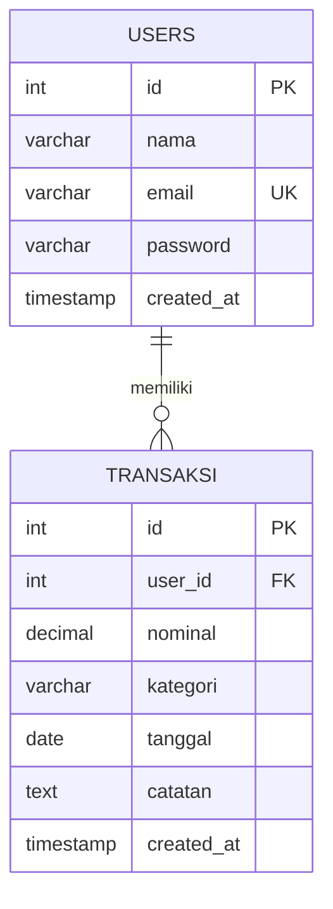

# DuitKu — Pelacak Pengeluaran Mahasiswa

Aplikasi Android untuk mencatat, mengelompokkan, dan memantau pengeluaran harian mahasiswa. Dibuat untuk memenuhi tugas UAS Mobile Programming (PG119) — Universitas Budi Luhur, Semester Genap 2025/2026.

## Anggota Kelompok

| Nama | NIM |
|---|---|
| Nazif Hamza Effendy | 2411501527 |
| Muhammad Iqbal Ghani | 2411501089 |

**Repository GitHub masing-masing anggota:**
- Nazif Hamza Effendy: `github.com/nazifeffendy28`
- Muhammad Iqbal Ghani: `github.com/muhiqbalghani`

---

## 1. Deskripsi Aplikasi

**Nama Aplikasi:** DuitKu

**Latar Belakang:**
Mahasiswa sering kesulitan mengontrol pengeluaran bulanan karena tidak mencatat transaksi harian secara konsisten. Kurangnya kebiasaan mencatat ini membuat pengeluaran sulit dipantau dan direncanakan, terutama untuk kebutuhan sehari-hari seperti makan, transportasi, dan keperluan kuliah.

**Tujuan Solusi:**
DuitKu hadir sebagai aplikasi sederhana yang membantu mahasiswa mencatat pengeluaran harian, mengelompokkannya ke dalam kategori (Makan, Transport, Kuliah, Hiburan, Lainnya), serta memantau total pengeluaran bulanan secara real-time. Seluruh data dikelola melalui backend REST API dan database MySQL, sehingga data tersimpan aman dan bisa diakses kapan saja.

---

## 2. Daftar Fitur

- **Register & Login** — autentikasi pengguna dengan validasi input
- **Dashboard Pengeluaran** — ringkasan total pengeluaran bulan berjalan
- **Daftar Transaksi Dinamis** — ditampilkan menggunakan RecyclerView, data diambil real-time dari REST API
- **Tambah Transaksi** — input nominal, kategori, tanggal, dan catatan dengan validasi input
- **Detail Transaksi** — melihat rincian lengkap satu transaksi
- **Edit Transaksi** — memperbarui data transaksi yang sudah ada
- **Hapus Transaksi** — menghapus transaksi dengan dialog konfirmasi
- **Notifikasi Pengingat (Firebase Cloud Messaging)** — fitur bonus untuk mengingatkan pengguna mencatat pengeluaran harian

---

## 3. Activity

| Activity | Fungsi |
|---|---|
| `LoginActivity` | Autentikasi pengguna (login) sebelum masuk ke aplikasi |
| `RegisterActivity` | Pendaftaran akun pengguna baru |
| `MainActivity` | Dashboard utama — ringkasan total pengeluaran & daftar transaksi (RecyclerView) |
| `AddEditTransactionActivity` | Form tambah transaksi baru maupun edit transaksi yang sudah ada (satu Activity, dua mode) |
| `DetailTransactionActivity` | Menampilkan detail satu transaksi, serta akses ke fitur edit dan hapus |

---

## 4. Intent

| Dari | Ke | Tujuan |
|---|---|---|
| `LoginActivity` | `RegisterActivity` | Berpindah ke form pendaftaran akun baru |
| `RegisterActivity` | `LoginActivity` | Kembali ke halaman login setelah berhasil daftar |
| `LoginActivity` | `MainActivity` | Masuk ke dashboard setelah login berhasil (membawa data user) |
| `MainActivity` | `AddEditTransactionActivity` | Menambah transaksi baru (mode tambah) |
| `MainActivity` | `DetailTransactionActivity` | Melihat detail transaksi yang dipilih dari daftar |
| `DetailTransactionActivity` | `AddEditTransactionActivity` | Mengedit transaksi yang sedang dilihat (mode edit) |
| `MainActivity` | `LoginActivity` | Logout, kembali ke halaman login dan menghapus riwayat activity stack |

---

## 5. Widget

- `TextInputLayout` & `TextInputEditText` — input form dengan floating label dan validasi
- `MaterialButton` — tombol aksi (Login, Daftar, Simpan, Edit, Hapus)
- `RecyclerView` — daftar transaksi dinamis
- `MaterialCardView` — kartu ringkasan total pengeluaran & item transaksi
- `FloatingActionButton` — tombol tambah transaksi cepat
- `Spinner` / `AutoCompleteTextView` — pemilihan kategori transaksi
- `DatePickerDialog` — pemilihan tanggal transaksi
- `ProgressBar` — indikator loading saat proses request ke REST API
- `Toolbar` — navigasi & judul halaman di setiap Activity
- `Snackbar` / `AlertDialog` — pesan error, konfirmasi hapus data

---

## 6. Library

| Library | Alasan Penggunaan |
|---|---|
| **Retrofit2 + Gson Converter** | Komunikasi HTTP ke REST API backend PHP secara type-safe dan efisien |
| **Material Components** | Menyediakan komponen UI modern (TextInputLayout, MaterialCardView, FAB) sesuai kaidah Material Design |
| **Firebase Cloud Messaging** | Mengirim notifikasi pengingat pencatatan pengeluaran (fitur bonus) |
| **AndroidX RecyclerView & CardView** | Menampilkan daftar data secara dinamis dan efisien |

---

## 7. Database

**Jenis:** MySQL/MariaDB, diakses melalui REST API berbasis PHP (tanpa database lokal/SQLite/Room).

### Entity Relationship Diagram (ERD)

Relasi: satu `users` dapat memiliki banyak `transaksi` (one-to-many).

Skema lengkap tersedia di `backend/schema_duitku.sql`.

---

## 8. REST API

Seluruh endpoint dan contoh request/response tersedia lengkap di `docs/API_Documentation_DuitKu.md`.

Ringkasan endpoint:

| Method | Endpoint | Fungsi |
|---|---|---|
| POST | `/register.php` | Registrasi user baru |
| POST | `/login.php` | Login user |
| GET | `/transaksi.php?user_id=` | Ambil semua transaksi milik user |
| GET | `/transaksi.php?id=` | Ambil detail satu transaksi |
| POST | `/transaksi.php` | Tambah transaksi baru |
| PUT | `/transaksi.php` | Update transaksi |
| DELETE | `/transaksi.php?id=` | Hapus transaksi |

---

## 9. Cara Menjalankan Aplikasi

### Backend
1. Copy folder `backend/duitku-api` ke folder `htdocs` (XAMPP) atau `www` (Laragon)
2. Import `backend/schema_duitku.sql` melalui phpMyAdmin
3. Jalankan Apache & MySQL dari XAMPP/Laragon
4. Detail lengkap ada di `backend/duitku-api/README.md`

### Android
1. Buka project di Android Studio
2. Sesuaikan base URL Retrofit di `RetrofitClient.java`:
   - Emulator: `http://10.0.2.2/duitku-api/`
   - HP fisik: `http://<IP-laptop>/duitku-api/` (satu jaringan WiFi)
3. Untuk fitur Firebase Cloud Messaging, tambahkan file `google-services.json` dari Firebase Console ke folder `app/`
4. Jalankan aplikasi (Run ▶️)

---

## 10. Tautan Deliverables

- **File APK:** `<isi link Google Drive/GitHub APK di sini>`
- **Video Demo:** `<isi link YouTube/Google Drive video demo di sini>`

---

## Lisensi

Tugas ini dibuat untuk keperluan akademik — Universitas Budi Luhur, Fakultas Teknologi Informasi.
